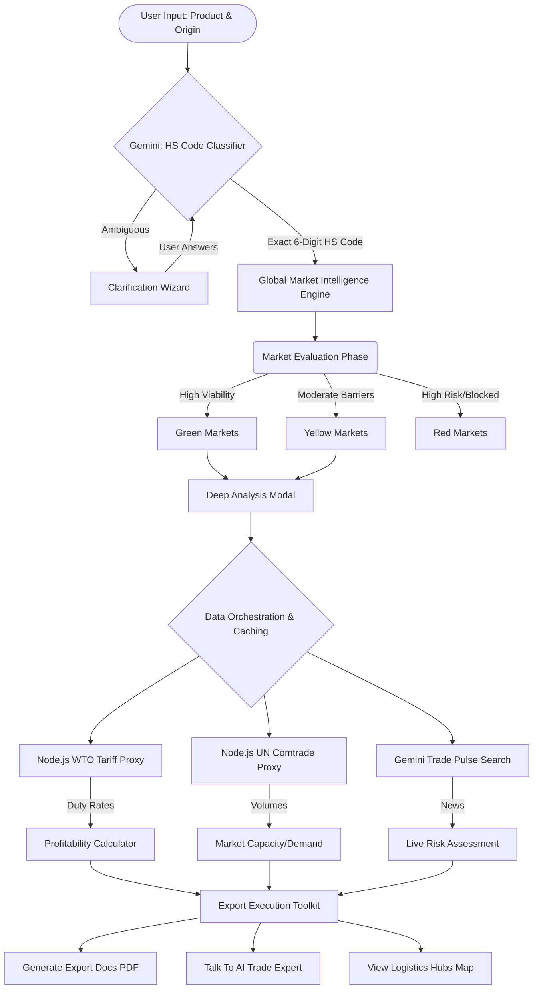

# Global Trade Intelligence Engine 🌍

A full-stack, AI-first application designed to help SME factory owners and exporters navigate international trade, customs compliance, and market viability. Powered by the Gemini API, World Trade Organization (WTO) Tariffs, and UN Comtrade data.

## Features

- **Intelligent HS Code Classification**: Uses Gemini to determine the exact 6-digit Harmonized System (HS) code. Includes a smart ambiguity-detection wizard that actively asks the user clarifying questions for perfectly accurate classification.
- **Global Market Heatmap**: Evaluates and categorizes international markets into Green (Go), Yellow (Caution), and Red (No-Go) zones based on trade barriers, geopolitical relationships, and demand.
- **Authoritative Data Grounding**: Proxies real-time data from authoritative sources (WTO and UN Comtrade) to provide verifiable duty rates and historical trade volume data.
- **Landed Cost & Profitability Simulator**: Calculates end-to-end export feasibility, factoring in manufacturing costs, logistics, import duties, and taxes against estimated local retail prices.
- **Live Trade Pulse**: Uses AI-driven web search (Google Grounding) to fetch the latest high-impact trade news, sanctions, and logistics risks for target destinations.
- **Export Document Generator**: Automatically generates industry-standard PDFs for Commercial Invoices and Certificates of Origin directly within the browser.
- **Expert Trade Consultant (AI Chat)**: A "Talk to an Expert" virtual agent programmed with deep custom knowledge on international logistics and customs law to answer specific, situational compliance questions.
- **Interactive Logistics Map**: Integrates Google Maps Platform (Geocoding & Places APIs) to identify major ports, shipping hubs, and logistics routes for any given destination.

## Architecture & Data Flow

The following Mermaid graph outlines the data progression from a user's raw product description to actionable export documentation.



## Tech Stack

* **Frontend**: React 18, TypeScript, Vite, Tailwind CSS, Framer Motion, and D3.js with TopoJSON.
* **Backend/Proxy**: Express.js (Node.js) server used strictly to securely proxy requests to the WTO and UN Comtrade APIs, avoiding CORS issues and exposing API keys.
* **Database & Auth**: Firebase Authentication (Google Auth) and Firestore (used as a powerful caching layer to reduce redundant AI generation and API proxy calls).
* **AI Engine**: Google Cloud Gemini API (`gemini-3.1-pro-preview` for complex reasoning, `gemini-3-flash-preview` for fast structured data generation).
* **Maps**: Google Maps Platform (`@vis.gl/react-google-maps`).
* **PDFs**: `jspdf` and `jspdf-autotable`.

## Setup & Local Development

### 1. Environment Variables
Create a `.env` file in your root directory. The application requires several keys to operate efficiently. 

```env
# Google Cloud
GEMINI_API_KEY=your_gemini_api_key
VITE_GOOGLE_MAPS_PLATFORM_KEY=your_google_maps_key

# Trade APIs (Required for accurate authoritative Mode)
WTO_API_KEY=your_wto_api_key
UN_COMTRADE_API_KEY=your_comtrade_key

# Firebase Client configuration
VITE_FIREBASE_API_KEY=your_firebase_api_key
VITE_FIREBASE_AUTH_DOMAIN=your_project.firebaseapp.com
VITE_FIREBASE_PROJECT_ID=your_project_id
```

### 2. Installation
Install all Node dependencies:
```bash
npm install
```

### 3. Running the App
Since the application uses an integrated Express proxy backend, start the combined server using:
```bash
npm run dev
```

*(Note: Ensure your development server is running on Port 3000, as configured in the `package.json`.)*

### 4. Building for Production
```bash
npm run build
npm start
```

## Resilience & Caching

Because international trade datasets and AI generations are highly dense and rate-limit prone, the engine employs a robust **Exponential Backoff & Jitter** mechanism wrapped around API calls (via a custom `withRetry` utility in `src/services/gemini.ts`). 

Successfully generated trade policies, HS Codes, and risk pulse matrices are aggressively cached into **Firebase Firestore** to ensure sub-second retrieval times on subsequent identical searches, saving LLM tokens and external API quoatas.

---
*Built with ❤️ utilizing Google Gemini, React, and Open Trade Data.*
